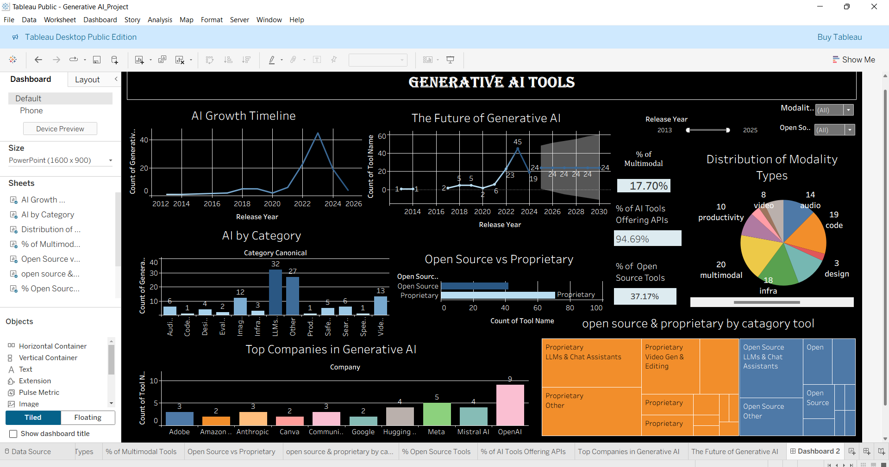
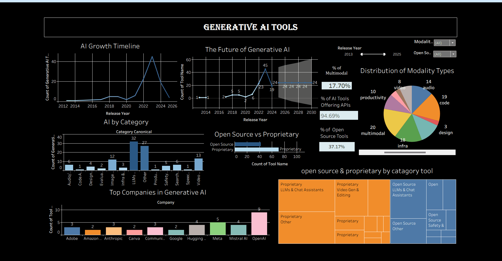

# Generative-ai-tools-tableau-analysis

## 📊 Project Overview

This project analyzes Generative AI tools and platforms using Tableau.

The analysis explores the growth of Generative AI tools over time, their different modalities and categories, the distribution of open-source and proprietary tools, API availability, major companies represented in the dataset, and future growth trends using Tableau forecasting.

The project was created to demonstrate practical skills in data visualization, dashboard development, KPI analysis, filtering, and forecasting using Tableau.

---

## 🎯 Project Objectives

- Analyze the growth of Generative AI tools over time
- Explore the distribution of different AI modalities
- Compare open-source and proprietary AI tools
- Analyze API availability across the tools
- Identify companies with multiple Generative AI tools
- Analyze Generative AI tools by category
- Explore future growth trends using Tableau forecasting
- Build an interactive dashboard for data exploration

---

## 📁 Dataset

The dataset contains information about Generative AI tools and platforms.

Key fields used in the analysis include:

- Tool Name
- Company
- Release Year
- Category
- Modality
- Open Source Status
- API Availability

The analysis and insights in this project are based on the tools included in the provided dataset.

---

## 🛠️ Tools & Technologies

- **Tableau Public**
- Data Visualization
- Interactive Dashboards
- KPI Analysis
- Filters
- Trend Analysis
- Forecasting

---

## 📈 Dashboard Features

### 1. AI Growth Timeline

Shows the number of Generative AI tools released over time and highlights the growth of tool development across different years.

### 2. AI by Category

Analyzes the distribution of Generative AI tools across different categories.

### 3. Open Source vs Proprietary

Compares open-source and proprietary Generative AI tools represented in the dataset.

### 4. Modality Distribution

Analyzes the distribution of different modalities, including:

- Audio
- Code
- Design
- Image
- Infrastructure
- Multimodal
- Productivity
- Safety
- Text
- Video

 ### 5. API Availability

A KPI visualizes the percentage of tools in the dataset that offer API access.

### 6. Top Companies

Identifies the top companies represented by the number of Generative AI tools in the dataset.

### 7. Future of Generative AI

Uses Tableau forecasting to analyze potential future trends based on the historical release pattern in the dataset.

---

## 📊 Key Performance Indicators

The dashboard includes KPI cards for:

- Multimodal Tools
- Open Source Tools
- Tools Offering APIs

The dataset analysis shows that approximately **94.69% of the tools included in the dataset offer API access**.

> **Note:** This percentage represents the dataset analyzed in this project and should not be interpreted as a statistic for the entire Generative AI industry.

---

## 🔍 Key Insights

- **Rapid growth from 2021 onward:** The number of Generative AI tools increased significantly from 2021, with particularly strong growth observed through 2021–2023.

- **Evolution toward multimodal capabilities:** Alongside the growth in the number of tools, the dataset shows increasing representation of multimodal tools that support multiple types of inputs or outputs.

- **Expansion beyond text-based AI:** Generative AI tools in the dataset span multiple modalities, including text, image, audio, video, code, and multimodal applications.

- **High API availability:** Approximately **94.69% of the tools in the dataset offer API access**, indicating strong potential for integration and application development.

- **Open-source and proprietary ecosystems:** Both open-source and proprietary tools are represented in the dataset, with proprietary tools having a larger share.

- **Moderated future growth:** The Tableau forecast indicates continued growth beyond the historical period, but at a more moderated pace.

> **Note:** These findings describe patterns observed in the dataset and should not be interpreted as representing the entire Generative AI industry.

---

## 🎛️ Interactive Filters

The dashboard provides interactive filters for exploring the data:

- **Release Year**
- **Modality**
- **Open Source**

These filters allow users to explore different aspects of the Generative AI tool landscape.

---

## 📈 Forecasting

Tableau's forecasting functionality was used to project future trends based on the historical release pattern of Generative AI tools in the dataset.

The forecast indicates a potential stabilization and more moderated growth beyond the historical period.

> Forecast results are based on the historical data available in this dataset and should not be interpreted as a definitive prediction of the future Generative AI industry.

---

## 📸 Dashboard Preview

### 🎥 Dashboard Demo

---

## 📂 Project Structure

- `README.md` — Project overview, analysis, and key findings
- `dashboard_preview.png` — Dashboard screenshot
- `dashboard_demo.gif` — Dashboard demonstration
- `Generative AI_Project.twb` — Tableau workbook
- `Generative AI Tools - Platforms 2025.xlsx` — Dataset
- `Generative AI Tools.pptx` — Project presentation

---

## 💡 Business Perspective

The dashboard provides a high-level view of the Generative AI tools represented in the dataset.

It helps explore:

- Growth of Generative AI tools
- Different AI modalities
- Open-source vs proprietary tools
- API availability
- Companies represented in the dataset
- Future growth patterns

---

## 📌 Conclusion

This project demonstrates how Tableau can be used to transform a Generative AI tools dataset into an interactive analytical dashboard.

The analysis combines trend analysis, category analysis, KPI visualization, interactive filtering, company analysis, and forecasting to explore the development of Generative AI tools.

---

## 👤 Author

**Harsha Janardhanan**

**Data Analyst | Python | SQL | Excel | Power BI | Tableau**

📧 **[Email Me](mailto: harshajanardhanan2@gmail.com)**  

🔗 **LinkedIn:** **[Harsha Janardhanan](https://www.linkedin.com/in/harshajanardhanan/)**
