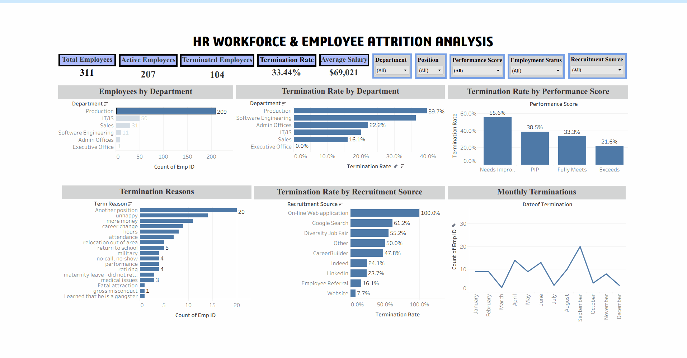
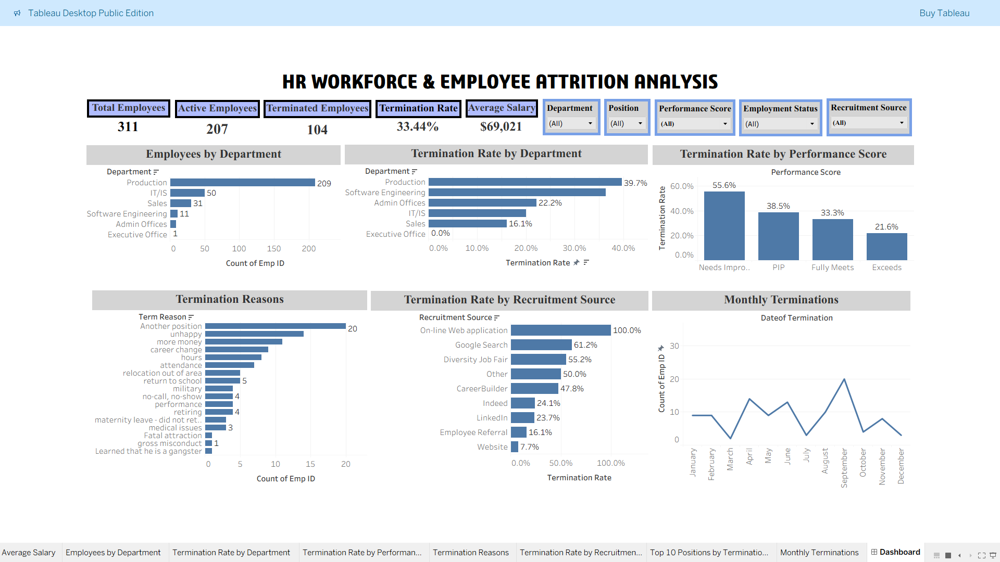

# HR Workforce & Employee Attrition Analysis 

An interactive Tableau dashboard analyzing workforce composition, employee termination patterns, performance, termination reasons, and recruitment sources.

## 📊 Project Overview

Employee retention is an important concern for HR teams. This project analyzes employee-level HR data to identify workforce patterns and areas that may require further investigation.

The dashboard provides an interactive overview of workforce size, active and terminated employees, historical termination rates, department-level patterns, performance, termination reasons, recruitment sources, and monthly termination trends.

The project was designed as a single-page interactive Tableau dashboard for clear and efficient HR reporting.

## 🎯 Business Objectives

The analysis aims to answer key HR questions:

- How large is the workforce?
- How many employees are currently active versus terminated?
- Which departments have higher historical termination rates?
- How does termination rate vary across performance categories?
- What are the most common recorded termination reasons?
- How do historical termination rates vary across recruitment sources?
- Which months have higher termination activity?

## 📁 Dataset

The dataset contains employee-level HR information covering workforce, employment, compensation, performance, attendance, recruitment, and termination-related attributes.

### Dataset Size

- **311 employee records**
- **36 fields**

### Key Data Areas

- Employee information
- Department and position
- Employment status
- Date of hire
- Date of termination
- Termination reason
- Salary
- Performance score
- Employee satisfaction
- Engagement survey score
- Absence
- Days late
- Special project count
- Recruitment source
- Manager information
- Demographic and location information

## 🛠️ Tools & Skills

- Tableau
- Microsoft Excel
- Data Visualization
- Calculated Fields
- Interactive Filters
- Dashboard Design
- HR Analytics
- Business Intelligence

## 📌 Key KPIs

| KPI | Value |
|---|---:|
| Total Employees | 311 |
| Active Employees | 207 |
| Terminated Employees | 104 |
| Historical Termination Rate | 33.44% |
| Average Salary | $69,021 |

## 📈 Dashboard Analysis

### Workforce Overview

The dashboard provides an overview of the employee workforce and its distribution across departments.

### Department-Level Termination

Termination rates are compared across departments to identify areas with higher historical employee exits and potential retention concerns.

### Performance & Termination

Historical termination rates are analyzed across employee performance categories to identify patterns between performance classification and employee termination.

### Termination Reasons

The dashboard highlights the most frequently recorded reasons for employee termination, providing insight into potential areas for employee retention initiatives.

### Recruitment Sources

Termination rates are compared across recruitment sources to identify differences in historical retention outcomes.

Recruitment-source results should be interpreted together with the number of employees recruited through each source, particularly when a category has a small number of employees.

### Monthly Terminations

Monthly termination activity is visualized to identify periods with higher concentrations of employee exits.

## 💡 Key Insights

- The dataset contains **311 employees**, including **207 active employees and 104 terminated employees**.
- The historical termination rate is **33.44%**.
- **Production** represents the largest department in the dataset.
- Production has a historical termination rate of approximately **39.7%**.
- Employees classified as **Needs Improvement** have the highest historical termination rate among the performance categories at **55.6%**.
- **Another position** is the most frequently recorded termination reason.
- Historical termination rates vary across recruitment sources, although smaller recruitment groups should be interpreted cautiously.
- Monthly termination activity varies throughout the year, with **September** showing the highest termination count in the dataset.

## 🎯 Business Recommendations

Based on the observed patterns:

1. Investigate the relatively high historical termination rate in the Production department.
2. Review employee support, training, and performance-management practices for employees in lower performance categories.
3. Analyze the most common termination reasons to identify potential retention opportunities.
4. Evaluate recruitment sources using both termination rates and recruitment volume rather than percentage alone.
5. Monitor monthly termination patterns to identify periods requiring additional HR attention.

## ⚠️ Limitations

- The dataset contains 311 employee records and should not be considered representative of the wider workforce or HR industry.
- The 33.44% figure represents the historical proportion of terminated employees in this dataset and should not be interpreted as an annual attrition rate.
- Some recruitment-source and position categories may contain relatively few employees, making percentage-based comparisons less reliable.
- The analysis identifies patterns and associations but does not establish causal relationships.
- Termination reasons represent recorded categories in the dataset and may not capture every factor influencing employee exits.

## 🖥️ Dashboard Preview

### Interactive Dashboard Demo

### Dashboard Screenshot

## 📌 Conclusion

The analysis provides a clear view of workforce composition and employee attrition patterns. The Tableau dashboard helps identify areas with higher termination rate by department,performance score,month,recruitment source and termination reasons.

These insights can help HR teams understand where attrition is concentrated, identify workforce trends, and make more informed decisions regarding employee retention, recruitment, and workforce planning.

## 👤 Author

**Harsha Janardhanan**

**Data Analyst | Python | SQL | Excel | Power BI | Tableau**

📧 **[Email Me](mailto: harshajanardhanan2@gmail.com)**  

🔗 **LinkedIn:** **[Harsha Janardhanan](https://www.linkedin.com/in/harshajanardhanan/)**
